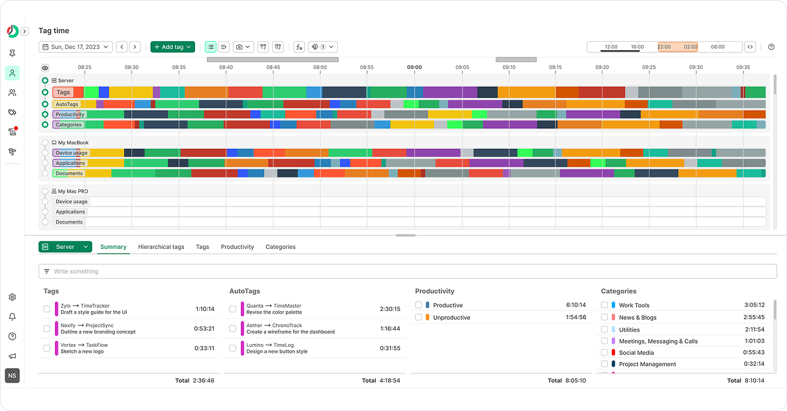
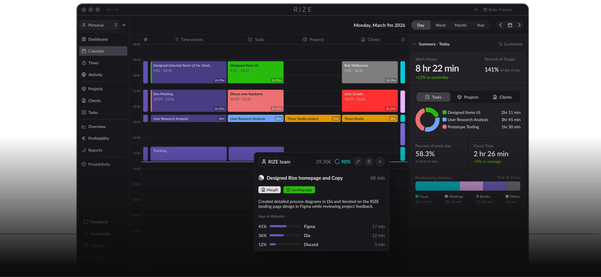
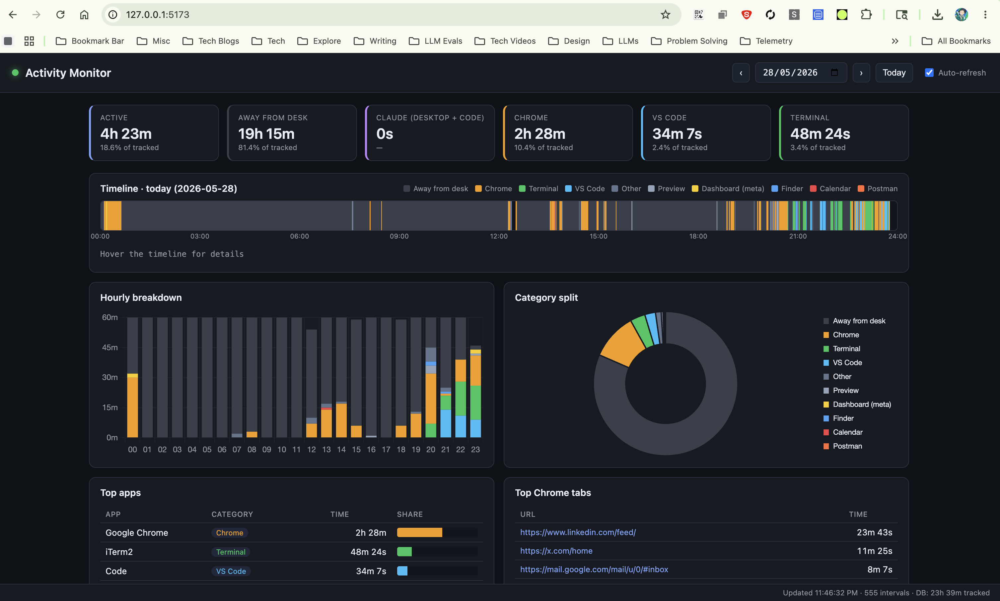

We live in distracting times. An article from the [Harvard Business Review](https://hbr.org/2022/08/how-much-time-and-energy-do-we-waste-toggling-between-applications) says

> To execute a single supply-chain transaction, each person involved switched about 350 times between 22 different applications and unique websites. Over the course of an average day, that meant a single employee would toggle between apps and windows more than 3,600 times. That’s … a lot. This kind of toggling is often dismissed as simply “how we work now,” even though it’s also taxing for people and a waste of time, effort, and focus. Yet these trends are likely to continue or get worse in an increasingly digital and remote work world. This should give companies pause.

Now I'm not proposing a cure for this cancer. I don't have one. 

But I **have** always been a big fan of knowing how productive I am in a work day vs not. How many times do I switch contexts? How many websites do I visit in the course of an hour? 

The earliest instance of a solution I can remember is when I found [ManicTime](https://www.manictime.com/) in 2017. I immediately installed it on my laptop. I Loved it. It gave me all the information I needed about what I was doing during work, where my time was going, how long I was away and more. It looked like this - 

I used it for quite a while. 

Then I heard about **Rize** last year . It looked much better than ManicTime. Understandable since it was actually built for a consumer rather than for a service based company. But it cost way too much for a personal tracking software. 

In the pursuit of finding a better Manictime and a cheaper Rize, I landed last year on [Activity Watch](https://activitywatch.net/). It came close to the best activity monitor I had ever used. It was opensource, configurable and I could add my own watchers. 

I think even now it might be something I could configure for my Mac. 

But the lure of vibecoding something for myself was too strong. 
Why, even Bilbo struggled with the dilemma - 

That's how I ended up creating the configurable, highly unimaginatively named - "Activity Monitor". The caveat is that this is built only for the Mac as of this writing. I plan to extend it to Windows and Linux as well. 

It runs completely locally and tracks all my activities - which applications were used, which websites were accessed, how long I was away from my desk, how long I was active on certain applications I care about (Chrome, VS Code, Terminal etc. )

