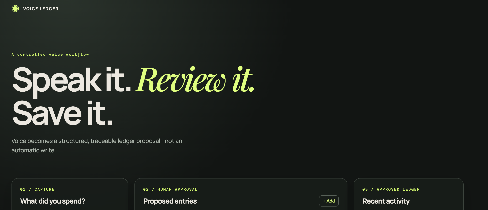

# Voice Expense Ledger Agent

A small workshop demo: voice note → Sarvam translation → LangGraph proposal → human approval → SQLite ledger. The workshop UI is React; Python is only the agent/API layer.

## React interface



## Run it

```bash
cd workshops/iim-workshop-08-08-26/voice-expense-agent
cp .env.example .env
uv venv
source .venv/bin/activate
uv pip install -r requirements.txt
# terminal 1: agent API
uvicorn api:app --port 8001 --reload

# terminal 2: React UI
cd frontend
npm install
npm run dev
```

Without `SARVAM_API_KEY`, paste a transcript and the rest of the graph remains demonstrable.
Without `GROQ_API_KEY`, the app uses a deterministic extraction fallback.

## Workshop architecture

1. **Sarvam STT boundary**: short audio becomes text. It is isolated in `sarvam_stt.py`.
2. **LangGraph**: `extract → validate → END`; it proposes but never writes.
3. **Human approval boundary**: the participant edits and approves the proposed entries.
4. **Ledger tool**: `save_transactions` writes approved data to local SQLite only.

The extraction node uses LiteLLM with Groq when `GROQ_API_KEY` exists and falls back to deterministic parsing on failure. When Langfuse keys exist, the app creates a native Langfuse generation around the Groq call, recording input, output, model, latency, and token usage. The workshop can compare those paths with a small golden set.
